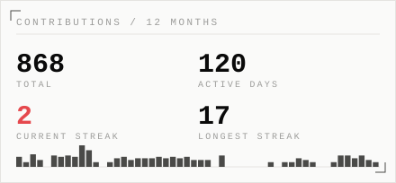
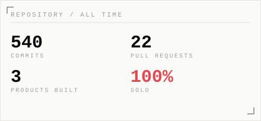
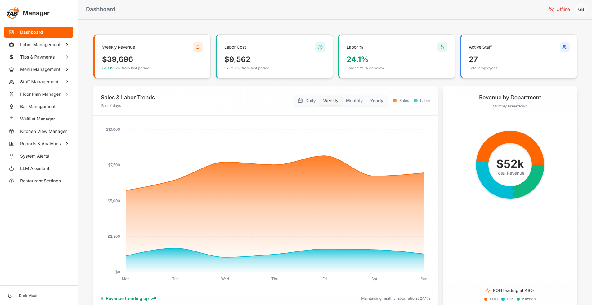
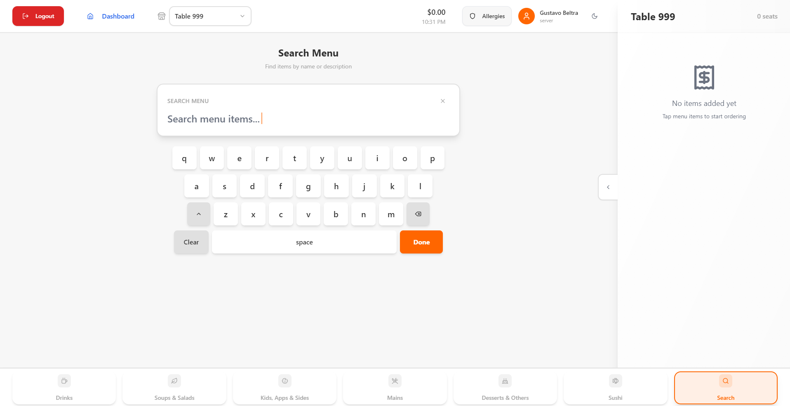
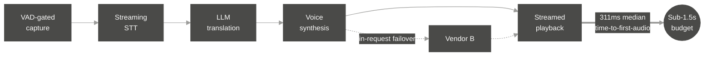
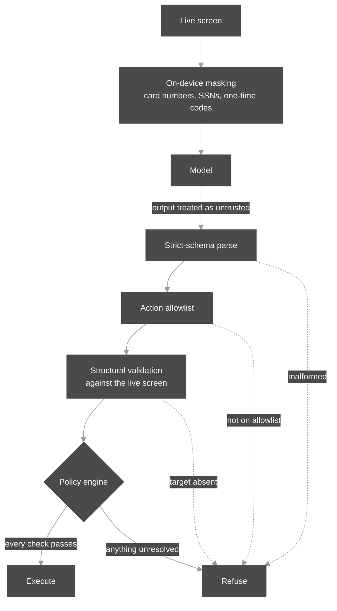

<picture>
  <source media="(prefers-color-scheme: dark)" srcset="assets/banner-dark.svg">
  
</picture>

`ACTIVITY`

<picture>
  <source media="(prefers-color-scheme: dark)" srcset="https://raw.githubusercontent.com/GustavoFBeltra/GustavoFBeltra/output/snake-dark.svg">
  
</picture>

<picture>
  <source media="(prefers-color-scheme: dark)" srcset="assets/card_activity_dark.svg">
  
</picture>
<picture>
  <source media="(prefers-color-scheme: dark)" srcset="assets/card_repos_dark.svg">
  
</picture>

---

I build the whole thing: schema, backend, interface, payments, and the deployment pipeline. Three
platforms so far, all solo. Most of the work sits in private repositories, so this page is the
catalog.

---

`THE CATALOG`

## BI-01 · TAB Point of Sales

`COMMERCE & OPERATIONS`  `ACTIVE DEVELOPMENT`

High-performance POS for hospitality and retail. Seven applications built solo over three years: an
Electron terminal, a handheld server app, a manager desktop, a kitchen display system, an Android
payment app running on Stripe S700 hardware, plus the marketing site and waitlist.

The parts worth talking about: offline order queuing that reconciles on reconnect, terminal batch
reconciliation against ticket-level records, and a relational schema covering menus, modifiers,
tickets, seats, employees, shifts, and payments.

<picture>
  <source media="(prefers-color-scheme: dark)" srcset="assets/tab-manager-dark.png">
  
</picture>

Manager desktop. Sales and labor trends, department revenue split, and live labor percentage
against target. The offline indicator is real: the terminal keeps taking orders when the connection
drops and reconciles them on reconnect.

<picture>
  <source media="(prefers-color-scheme: dark)" srcset="assets/tab-pos-dark.png">
  
</picture>

Server terminal. Touch-first, on-screen keyboard, category tabs, and the open ticket held
alongside the menu.

[tab-pos.com](https://tab-pos.com)

---

## BI-02 · Yapr

`LANGUAGE & COMMUNICATION`  `ACTIVE DEVELOPMENT`

Real-time voice translation, built twice natively. Swift and SwiftUI on iOS, Kotlin and Jetpack
Compose on Android, no shared UI code, six product surfaces held at parity by a 33-point audit.

A five-stage voice pipeline runs against a sub-1.5 second budget and streams first audio before
translation finishes. Median time-to-first-audio is 311ms. Per-turn cost came down 61% after I
worked out that synthesis was about 87% of unit cost and routed across two vendors with in-request
failover.

Playback starts before translation completes, so what the user hears begins at the first stage while
the rest of the pipeline is still running.

  <video src="https://github.com/user-attachments/assets/7d9d2d71-7bd0-47c5-a304-375c91deae03" width="300" controls muted></video>

Yapr on Android. Language pair, then the mic, then translated speech in the other person's language.

Translation is the core, and it sits inside a travel dashboard. Arrive somewhere and the app resolves
the destination into what you need in the first ten minutes: local time, currency, weather, the
emergency number, whether to tip, which plug and what voltage, whether the tap water is safe. Under
that, a quick-phrase bar and a local news feed with each headline translated and the original kept
underneath.

There is also an emergency screen with country-specific service numbers, Medical ID, and an SOS
beacon, and its translations work with no connection at all.

The third piece is a course that does not exist until you ask for it. You state a goal, an edge
function generates and validates a curriculum, and the app plays it through seven exercise types.
Speaking drills score against the same streaming STT the translator uses; the rest grade on-device.
Completed material decays back into review on an SM-2-style schedule, and each unit ends in a scoped
roleplay conversation that gets graded.

Backend is 23 Deno edge functions with row-level security and rate limiting. EU AI Act Article 50
disclosure and US state biometric consent gating are enforced server-side.

Also in there: an **Android Auto** surface built on the Car App Library, so the interpreter and the
emergency screens project onto a head unit through the host's templates instead of Compose. TOTP
two-factor with server-side step-up on sensitive operations, and a biometric app lock. GDPR export
and deletion, both backed by their own edge functions. A home-screen widget that keeps the streak
current without opening the app.

Both platforms carry the full screen set. Android is feature-complete, iOS is in final pre-release
testing. Neither app is published to a store.

[yap-r.com](https://yap-r.com)

---

## BI-06 · Kinly

`ACCESSIBILITY & ASSISTANCE`  `ACTIVE DEVELOPMENT`

Technology, on your terms. An Android accessibility companion for older adults and people with
visual, motor, or cognitive disabilities. You state a goal in plain language and it explains the
screen, highlights the right control, or walks you through it.

It treats model output as untrusted input. Strict-schema parsing against an action allowlist,
structural validation against the live screen, then a deterministic fail-closed policy engine.
On-screen text is never executed as an instruction, so a malicious app cannot steer the agent
through content it renders. Card numbers, SSNs, and one-time codes are masked on the device before
anything reaches the model.

Nothing reaches the model unmasked, and nothing reaches the screen unvalidated. Every rejection path
converges on refusal, so an unexpected state fails closed instead of guessing.

92 tests across 53 source files. Green build gate on compilation, tests, lint, and detekt.

---

`TECHNOLOGY`

**Languages**

**Interface**

**Backend and data**

**Machine learning and vision**

**Infrastructure**

---

`BEFORE THIS`

Five years at a 780-seat restaurant, promoted from expo to back of house manager, running up to 26
kitchen staff on nights around $139,000 in sales. The bar team was counting liquor on clipboards for
two hours, so I built them a web app that got it to 45 minutes. That is where the software started.

B.S. Engineering Technology, University of West Florida.

---

`CONTACT`

Native English and Spanish.

`EST. U.S.A. · BUILT FOR PRODUCTION`

